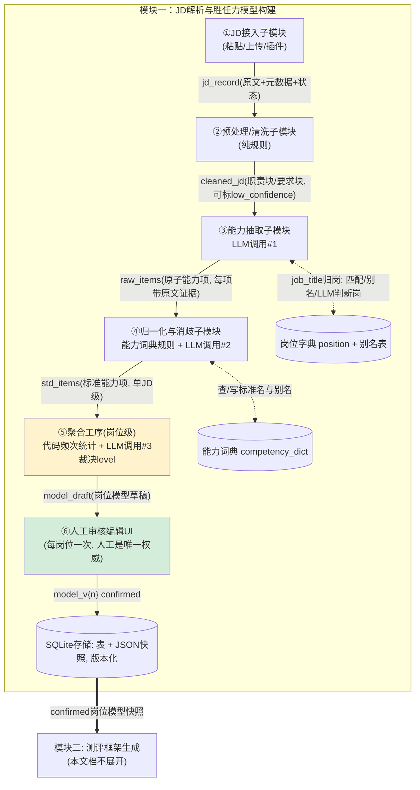
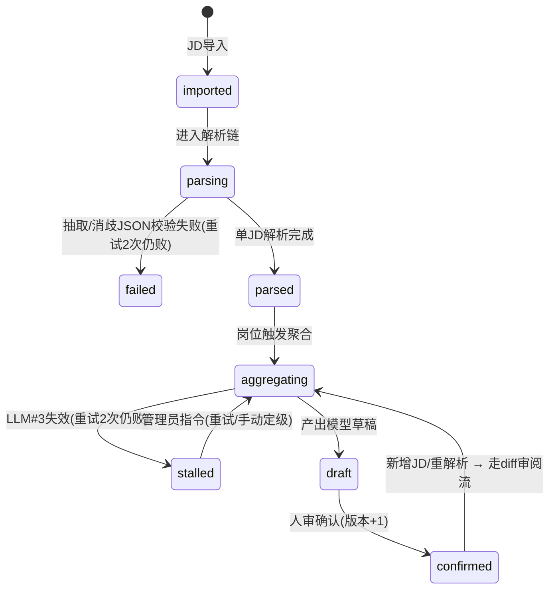
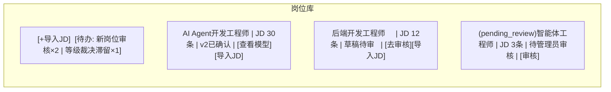

# 模块一设计：岗位JD解析与胜任力模型构建

## 重点和难点说明

### 1. 语义歧义的问题

首先是语义歧义的问题。我们在把能力块归到能力词典中的时候，词与词之间的界限在哪，怎样才能算两种不同的能力？比如"沟通能力"和"团队协作"，该怎么分割。同样的问题还出现在岗位词典中。

**我的解决方法：避免冷启动。** 冷启动的时候问题最多，歧义最大。优先做一些人工标注的数据先入库，这可以让后续入库更加通畅、高质量，少部分难以区分的可以降级给人工标注。

### 2. 分级震荡

同岗位聚合JD时按照能力块出现的频率来判断是required/preferred/plus中的哪一级，当N（样本数量）太小的时候，很容易导致分级震荡。

**我的解决方法：等N足够大，积累到一定数量才聚合**。

---

> 本文档是《技术方案概述.md》（原 03）"三、核心功能模块与实现原理 → 1. 岗位JD解析与胜任力模型构建"的详细设计。
> 范围：仅模块一。模块二（测评生成）与模块三（画像评估）只定义输入契约，不展开。
> 图表均为 Mermaid，VS Code 安装 *Markdown Preview Mermaid Support* 插件、或使用 Typora / Obsidian / GitHub 即可可视化预览。

---

## 0. 设计目标与边界

| 项 | 内容 |
|---|---|
| 输入 | 合规三渠道获取的 JD 原文：手动粘贴 / 文件上传 / 浏览器插件推送 |
| 输出 | **已确认(confirmed)的岗位聚合胜任力模型**，带版本号，作为模块二出题与模块三打分的唯一依据 |
| 核心实体 | **岗位(Position)**。测评对象是岗位聚合模型，单条 JD 的解析结果只是中间产物 |
| 三大风险（设计围绕它们展开） | ① LLM 输出不稳定；② 能力项语义重合；③ 权重口径不可比 |
| 两条流程、两类操作者 | **建模流程**（数据准备方：导入→解析→归岗→聚合→审核）与**测评流程**（用户：选岗位→测评→看报告）。测评用户完全不接触建模流程 |

---

## 1. 总体流水线（子模块工序图）

单 JD 经过 ①~④ 完成解析；同岗位多条 JD 的结果经 ⑤ 聚合；人审只发生在聚合模型一层。



**工序职责表**

| 子模块 | 职责 | 输入 → 输出 | 执行者 |
|---|---|---|---|
| ①接入 | 三渠道收 JD、去重、元数据登记 | 文本/文件 → jd_record | 纯代码 |
| ②清洗 | 删噪音段（公司介绍/福利），分出职责块/要求块；要求块为空或过短则标 `low_confidence` | raw_text → cleaned_jd | 纯规则，无 LLM 兜底 |
| ③抽取 | 抠出**原子能力项**：名称、分类、原文证据、必备性、等级、job_title | cleaned_jd → raw_items | LLM 调用#1 |
| ④归一消歧 | 标准名映射、同义合并、语义重合裁决 | raw_items → std_items | 词典规则 + LLM 调用#2 |
| ⑤聚合 | 同岗位多 JD 的 std_items 融合成岗位模型草稿 | 多条 std_items → model_draft | 代码统计 + LLM 调用#3 |
| ⑥人审 | 改名/调权/删/增/改级/改归；确认后锁定 | draft → confirmed(版本+1) | UI(管理员) |

**关键原则：每道工序的中间产物全部落库**(cleaned_jd、raw_items、std_items 均留档)。好处：出错可定位到具体工序；重跑单步不必重跑全链；答辩"提示词工程迭代"有 trace 可展示。

---

## 2. 数据流详解：JD 如何变成模型

### 2.1 单 JD 解析链（工序 ①~④）

以一条 JD 为例：

> "3年以上后端开发经验，精通Python/Go，熟悉微服务架构，具备良好的沟通能力和团队协作精神；我们提供六险一金、下午茶、扁平化管理……"

**工序②清洗后**（福利段删除，仅留要求块）：
`"3年以上后端开发经验，精通Python/Go，熟悉微服务架构，具备良好的沟通能力和团队协作精神"`

**工序③ LLM调用#1 抽取输出**(raw_items):

```json
{
  "job_title": "后端开发工程师",
  "items": [
    {"name":"Python",     "category":"hard_skill", "required_level":4, "importance":"required",  "evidence":["精通Python/Go"]},
    {"name":"Go",         "category":"hard_skill", "required_level":3, "importance":"preferred", "evidence":["精通Python/Go"]},
    {"name":"微服务架构",  "category":"hard_skill", "required_level":3, "importance":"required",  "evidence":["熟悉微服务架构"]},
    {"name":"沟通能力",    "category":"soft_skill", "required_level":3, "importance":"required",  "evidence":["良好的沟通能力"]},
    {"name":"团队协作精神","category":"soft_skill", "required_level":3, "importance":"preferred", "evidence":["团队协作精神"]},
    {"name":"后端开发经验","category":"experience", "required_level":3, "importance":"required",  "evidence":["3年以上后端开发经验"], "years":3}
  ]
}
```

抽取提示词的四条硬性约束：①一项一能力，禁止"和/及"连写；②每项必须抄录 evidence 原文；③importance 三档依原文措辞（必须/精通→required，优先/熟悉→preferred，加分→plus);④required_level 按措辞映射到 1–5 级（"了解"→Lv1~2,"熟悉"→Lv3,"精通"→Lv4,"专家/带队"→Lv5)。

**工序④ 归一消歧后**(std_items)：查词典 → `团队协作精神` 命中别名 → 标准名 `团队协作`;`Python/Go` 精确命中；词典中的排除项确认"沟通能力"与"团队协作"语义不重合。

### 2.2 自动归岗（工序③旁路）

```
LLM#1 抽出 job_title
  → 与岗位字典匹配(规范化字符串 + 别名表)
    ├─ 命中/别名命中 → 直接归入该岗位
    └─ 未命中 → 轻量 LLM 判断: 已有岗位别称 or 全新岗位
         ├─ 别称 → 归入, 该叫法写入岗位别名表
         └─ 全新岗位 → 创建岗位, status=pending_review
                       → 管理员审核合规性(是否真实岗位/命名是否规范)
                       ├─ 通过 → status=active, 参与聚合, 对测评用户可见
                       └─ 拒绝 → 岗位撤销, 其下 JD 退回待归属队列(可改归)
```

`pending_review` 状态的岗位**不产生聚合模型、不出现在测评用户的岗位列表**。

### 2.3 岗位聚合链（工序⑤)

同岗位 N 条 JD 全部走完 ①~④ 后触发聚合：

**Step 1 — 代码频次统计**（纯确定性）：按 `std_name + category` 分组，统计两个 JD 级比率（与单条 JD 内出现次数无关）:

- **总出现率** `r = 提到该项的 JD 数 / N`
- **必备率** `req = 把该项标为 required 的 JD 数 / N`

**Step 2 — importance 聚合映射**（阈值均为配置项，人审可调）:

| 条件 | 聚合 importance | 语义 |
|---|---|---|
| `req ≥ 50%` | required | 过半公司强制要求 → 市场硬门槛 |
| `req < 50% 且 r ≥ 50%` | preferred | 普遍提及但多为优先 |
| `r < 50%` | plus | 小众要求 |

> 设计说明：低频但措辞强硬的项（如 1/30 家"必须精通 Rust"）聚合后仍为 plus——聚合模型的职责是刻画**市场普遍要求**，抹平个别公司的特殊偏好。该信号不丢失：聚合界面每项标注 "k/N 条提及，其中 m 条为必备"，人审可手动提级；模块三报告可引用该统计。

**Step 3 — required_level 冲突裁决**（同一能力 A 岗要 Lv3、B 岗要 Lv4):**LLM 调用#3** 输入各 JD 原文证据与等级，输出一个等级 + 一句理由（留档）,**无自动取众数的后门**。

**Step 4 — 权重计算**（纯代码，LLM 不碰数字）:

- **第一级（类间）**：类间权重 5.5 : 2 : 2 : 0.5（配置项，人审可改）→ hard 55% / soft 20% / experience 20% / qualification 5%
- **第二级（类内归一）**：各类份额按类内各项 importance 系数（required 1.0 / preferred 0.6 / plus 0.3）分摊，类内加总 = 类份额，全模型加总 = 100%

算例：hard 类有 Python(required) 与 Go(preferred)，系数和 1.6 → Python = 55% × (1.0/1.6) ≈ 34.4%,Go ≈ 20.6%。

### 2.4 状态机与异常分支



- **单 JD 解析失败**：标 `failed`，不阻塞同岗位其他 JD，进人工录入队列。
- **LLM#3 失效**：岗位聚合标 `stalled`（滞留），管理员待办出现"等级裁决失败"，指令为"重试 LLM"或"手动定级"。整条流水线只此一个滞留点——聚合逻辑中**所有等级要么 LLM 裁决+理由、要么人定**。
- **LLM 不稳定的通用防御**：每次调用 JSON Schema 校验，失败带错误信息自动重试（最多 2 次）；所有 prompt + response 存 `llm_trace`。

---

## 3. 胜任力模型的数据定义

### 3.1 分类法：一级仅 4 类，对应不同测评策略

| 一类 | 定义 | 示例 | 对模块二的意义 |
|---|---|---|---|
| `hard_skill` | 可客观验证的技术/工具/方法 | Python、MySQL、微服务架构 | 技术问答/代码题 |
| `soft_skill` | 行为素质 | 沟通、自驱、Owner 意识 | 情景行为题(STAR) |
| `experience` | 经历门槛：领域/年限/项目类型 | 3年后端、电商行业经验 | 经历追问题 |
| `qualification` | 硬门槛：学历/证书/语言 | 本科、英语六级 | 门槛校验 |

### 3.2 能力项字段语义

| 字段 | 含义规定 |
|---|---|
| `std_name` | 标准名，必须来自/写入能力词典，禁止 JD 原文原词直接落库 |
| `definition` | 一句话定义 + **排除项**（消歧锚点）。例：`沟通能力{定义:跨角色信息传递与表达; 排除:团队协作}`、`团队协作{定义:共同目标下的分工配合; 排除:沟通能力}` |
| `evidence[]` | JD 原文引用，UI 联动高亮，也是人审依据 |
| `importance` | 三档：required 必备 / preferred 优先 / plus 加分 |
| `required_level` | 1–5 级，全类目统一锚点（见下），非 LLM 自由发挥 |
| `weight` | 模型内归一百分比，全模型 Σ=1，由代码计算 |
| `years` | 仅 experience 类，年限原值，**不折算进 required_level** |

**5 级 Dreyfus 锚点（全类目通用）**:Lv1 了解概念 → Lv2 指导下用过 → Lv3 独立完成常规工作 → Lv4 处理复杂问题/能优化 → Lv5 定方向/带他人。

**门槛项二值判定（统一规则）**:`qualification` 全部项与 `experience` 中的年限项，不参与 1–5 级评分，采用二值判定——达标拿满该项权重，不达标拿 0。例：用户年限 < JD 要求年限 → 年限项不得分；≥ → 满分。具体分值 **TBD**，后续补充。学历/证书同理。

**含义重合的消歧规则（裁决顺序）**:①抽取时强制原子化（源头掐死"A和B");②词典别名 + 排除项做字符串级命中；③LLM 调用#2 专门裁决"A 与 B 是否同义/包含？是则合并，保留更可测评的一项";④代码规范化字符串精确去重兜底。

**词典候选生成**：消歧时不把整本词典塞给 LLM——按类目过滤 + 编辑距离/拼音首字母模糊匹配取 top 10 候选（如"团队协作精神"→候选含"团队协作")。冷启动词典为空时跳过 LLM 消歧，仅做代码级精确去重；词典随使用渐进累积，前期容忍粗糙。

### 3.3 岗位聚合模型 JSON Schema（对模块二的输出契约）

```json
{
  "model_id": "cm_0001",
  "position_id": "pos_0007",
  "position_name": "AI Agent开发工程师",
  "version": 2,
  "status": "confirmed",
  "jd_count": 30,
  "category_weights": {"hard_skill": 0.55, "soft_skill": 0.20, "experience": 0.20, "qualification": 0.05},
  "items": [
    {
      "id": "c1",
      "std_name": "Python",
      "category": "hard_skill",
      "definition": "Python服务端/工具开发能力(不含算法岗的数值计算)",
      "required_level": 4,
      "level_reason": "高阶岗集中要求Lv4, 市场主流为Lv3, 取Lv4(LLM#3裁决)",
      "importance": "required",
      "weight": 0.19,
      "occurrence": {"r": 0.90, "req": 0.63},
      "evidence": [{"jd_id": "jd_0001", "text": "精通Python/Go"}]
    },
    {
      "id": "c9",
      "std_name": "后端开发经验",
      "category": "experience",
      "years": 3,
      "gate": true,
      "weight": 0.08
    }
  ]
}
```

- `gate: true` 标记门槛项（qualification 全部 + experience 年限项），模块三按二值判定处理。
- `occurrence` 保留聚合统计，供人审界面与模块三报告引用。
- 词典日后演进**不影响**已确认模型——快照即事实。

---

## 4. 界面设计（建模流程，操作者为管理员/数据准备方）

测评用户侧仅见 P5。状态机：`已导入 → 解析中 → (单JD失败→failed) → 聚合中 → (滞留→stalled) → 草稿待审 → 已确认`,confirmed 后新增 JD / 重解析走 diff 审阅流产生 v{n+1}。

### P1 岗位库页（管理员主页）



- `[+导入JD]` 弹窗：粘贴文本 / 拖文件 / 显示插件推送来源；**不要求选岗位**（归岗全自动）。
- 顶部待办区：新岗位审核、stalled 滞留项，是管理员的两个主要人工入口。

### P2 岗位详情页

该岗位下 JD 列表（来源/时间/解析状态：解析中✓/failed/low_confidence)+ 当前模型版本入口 + 版本历史入口。failed 的 JD 可人工补录。

### P3 模型审核页（核心界面，左右双栏联动）

```
┌─ 证据面板(点能力项时显示其各JD证据) ──┬─ 岗位模型·草稿        Σ=100% ✓ ──┐
│ jd_0001: "…精通▓Python▓/Go…"      │ ▸硬技能 55%                        │
│ jd_0004: "…熟练掌握Python…"        │  [Python] Lv4★必备 w19% r90% [✎][✕]│
│ jd_0011: "…Python开发经验…"        │  [Go]     Lv3○优先 w11% r40% [✎][✕]│
│ 出现率: 27/30条, 其中必备19条       │ ▸软技能 20% ……                    │
│ LLM#3理由: 高阶岗集中要求Lv4…      │ ▸经验  20% ……  ▸门槛 5% ……        │
│                                    │ [+加能力项][重新聚合][确认模型→]   │
└────────────────────────────────────┴───────────────────────────────────┘
```

- 每项展示：标准名 / 等级（含 LLM#3 理由） / importance / 权重 / 出现率统计，全部可编辑。
- 类间配比条（55/20/20/5）可直接拖动调整，类内权重自动重算。

### P4 版本历史与 diff 审阅页

confirmed 后重解析/新增 JD 时：

```
新解析结果(不落confirmed) → 自动与当前confirmed版diff
→ 逐能力项标记: [新增][已删除][字段变更: 权重19%→24% 等]
→ 逐项选择: 保留人工值 / 采用新值 / 手动再编辑
→ 确认 → 版本+1成为新confirmed; 旧版只读存档
→ 问题项可"打回"(标记issue, 不升版本)
```

**人工版本是唯一权威**：重解析只是"建议"，confirmed 版永远代表人工意志，不被静默覆盖。

### P5 测评用户视角（唯一可见界面）

岗位列表（仅 active 岗位）→ 选岗位 → 进入测评（模块二接管）→ 报告（模块三）。用户看不到 JD、词典、审核等任何建模元素。

---

## 5. 存储设计

**结论：SQLite 为底座（业务表管流转 + 模型整体 JSON 快照管内容），导出/交换用 JSON Schema，不上图谱。**

```sql
-- 岗位与JD
position(position_id, name, status, created_at)          -- status: pending_review/active
position_alias(alias_id, position_id, alias)             -- 岗位别名表(独立于能力词典)
jd_record(jd_id, position_id, job_title, company, source_type,
          raw_text, cleaned_text, status, created_at)    -- status: imported/parsing/parsed/failed

-- 模型(版本化, 快照即事实)
competency_model(model_id, position_id, version, status, -- status: draft/confirmed/stalled
                 model_json, llm_trace_json, created_at,
                 UNIQUE(position_id, version))
competency_item(item_id, model_id, std_name, category, required_level,
                importance, weight, years, gate, occurrence_json, evidence_json)
                -- 明细表: 支撑跨JD/跨岗位统计(迭代闭环分析靠它)

-- 能力词典(受控, 渐进式累积)
competency_dict(std_name, category, definition, aliases_json, created_by,
                PRIMARY KEY(std_name, category))          -- created_by: llm_pending/human
```

**为什么这样选型**

| 问题 | 回答 |
|---|---|
| 为什么"表 + JSON"混合 | 关系表干业务读写（列表/审核/版本/diff);`model_json` 快照保证模块二拿到的是确认时刻的完整模型，词典日后演进不影响复现——**"表管流转，JSON 管内容"** |
| 为什么不用图谱 | 当前只有"能力∈类目""能力—别名"两种平淡关系，Neo4j 是纯负担；词典表先攒数据，迭代闭环真要做"岗位族—能力关联分析"时再演进，代价可控 |
| 为什么不纯 JSON 文件 | 上百条 JD 的列表筛选、状态管理、版本 diff 全是关系型读写，文件方案全是体力活 |

---

## 6. 三次 LLM 调用的职责契约

| 调用 | 任务 | 输入 | 输出（强 Schema) | 失败处理 |
|---|---|---|---|---|
| #1 抽取 | 原子能力项抽取 + job_title | cleaned_jd(+few-shot) | items[]：名称/分类/等级/importance/evidence/years | JSON 校验失败重试×2 → JD 标 failed |
| #2 消歧 | 同义/包含/重合裁决 | raw_items + 词典候选(top10) | 合并映射表 + 标准名 | 校验失败重试×2 → 降级为代码精确去重 |
| #3 聚合裁决 | level 冲突裁决 + 理由 | 同能力各 JD 证据 + 等级 | 最终 level + reason | 重试×2 仍败 → 岗位 stalled，报管理员 |

通用约束：输出强制 JSON Schema；所有 prompt + response 落 `llm_trace_json`（答辩"提示词工程"素材 + 迭代闭环数据源）。

---

## 7. 质量保障与迭代闭环抓手

| 失效模式 | 机制 |
|---|---|
| LLM 随机错误（单点抽错） | **频次稀释**:N 条 JD 聚合，单条错误项 r 趋近 0，权重趋零。N 越大越稳 |
| LLM 系统性错误（提示词缺陷导致所有 JD 同错） | **黄金集**：人工标注 3–5 条 JD 的标准答案，每次改提示词后比对（能力项召回率 / 多余项 / 分类错误率），指标落库。频次稀释对此无效，必须靠它 |
| 语义重合 | 词典定义 + 排除项（词典层显式裁决） + LLM#2 + 代码去重，四道防线 |
| 词典积累 | 人审改名/设别名/新增标准名时**被动回写**词典（`created_by=human` 优先于 `llm_pending`)；不做独立词典后台，零额外界面 |

---

## 8. 决策记录（本设计的全部拍板项）

| # | 决策 | 结论 |
|---|---|---|
| 1 | 单 JD 解析 LLM 调用次数 | 两次（#1 抽取 / #2 归一消歧），任务单一、提示词可独立调优 |
| 2 | 权重计算 | 代码定量：类间 5.5:2:2:0.5（配置） × 类内 importance 系数（1.0/0.6/0.3) 归一；LLM 只给 importance 三档 |
| 3 | 能力词典冷启动 | 渐进式：LLM 产出自动入库（llm_pending) → 人审顺手确认 → 逐步收敛 |
| 4 | 能力等级 | 5 级 Dreyfus 锚点，措辞→等级映射表写入抽取提示词 |
| 5 | 测评对象 | **岗位聚合模型**；单 JD 解析为中间产物，不设人审 |
| 6 | JD 归岗 | 全自动：job_title 匹配→别名→LLM 判新岗；**新岗位需管理员审核**后生效；人工仅兜底可改归 |
| 7 | 人审范围与权威 | 只在聚合模型层（每岗位一次）；**人工是唯一权威**，重解析走 diff 审阅流，confirmed 不被静默覆盖 |
| 8 | importance 聚合 | 双比率：req≥50%→required,req<50% 且 r≥50%→preferred,r<50%→plus（阈值配置项） |
| 9 | level 聚合冲突 | LLM#3 裁决 + 理由留档；失效→stalled 滞留报管理员，无自动取众数后门 |
| 10 | 门槛项 | qualification 全部 + experience 年限项，二值判定（年限分值 TBD)，不进等级评分 |
| 11 | 清洗 | 纯规则 + low_confidence 标记，无 LLM 兜底 |
| 12 | 存储 | SQLite 六表 + 模型 JSON 快照，导出 JSON Schema，不上图谱 |

**遗留 TBD**:① 年限门槛的具体分值（待模块三设计时补充）;② importance 系数 1.0/0.6/0.3 与双比率阈值 50% 为默认值，预留调整空间。
